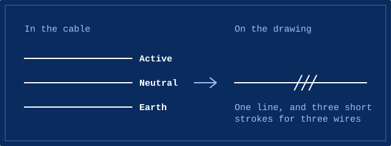
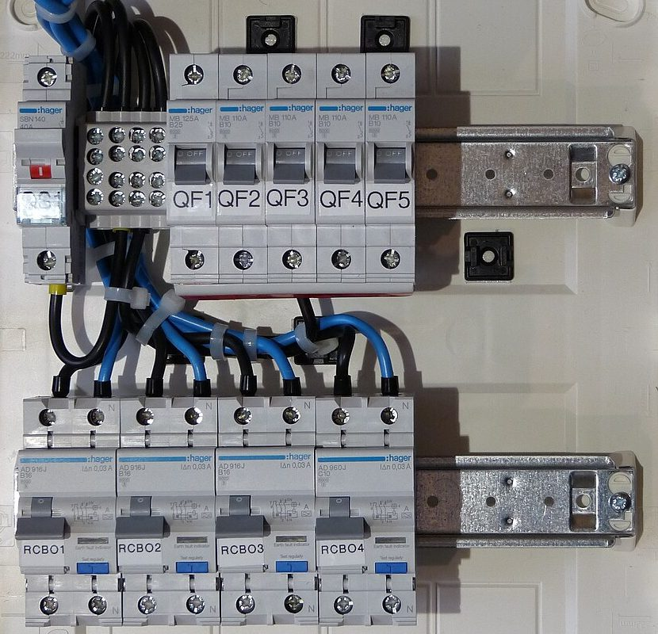

The road to launch on this site is drawn as a single-line diagram. It's a real kind of electrical drawing, and the idea behind it is simpler than it looks.

## One line for several wires

A real circuit has more than one wire in it. A typical one has an active, which carries the power out, a neutral, which carries it back, and an earth, which gives electricity a safe path if something goes wrong.

They're the three colours in the stripe above this site's footer: brown for active, blue for neutral, and green and yellow for earth.

Draw every wire of every circuit in a building and you get a tangle nobody can follow. So a single-line diagram draws each circuit as one line, and trusts the reader to know the rest are there.

## A map of the flow, not the building

A single-line diagram doesn't show where cables run through walls and ceilings. Other drawings do that job.

This one shows the order things connect in. It starts where the power comes from, follows it through everything that switches and protects it, and ends at whatever it runs.

## Reading one from the supply down

Start where the power comes in, usually at the top or on the left. That's the supply.

Next there's normally a main switch, which can turn off everything after it.

After that, the power splits into circuits, and each one passes through protection before it goes anywhere:

- A circuit breaker turns a circuit off if too much current flows through it. Its job is to stop the cable from overheating.
- A safety switch, also called an RCD (residual current device), turns a circuit off if some of the current is leaking somewhere it shouldn't, such as through a person. Circuit breakers mainly protect cables. Safety switches are there to protect people.

. In a switchboard, it clips onto a metal rail beside the circuit breakers. Photo: Diermaier, CC0.")

At the end of each line is a load, which is the thing that uses the power. A lamp is drawn as a circle with a cross through it. Most of the symbols come from international standards, so a drawing made in one place can be read in another.

## The labels matter as much as the lines

Next to each circuit you'll normally find labels, such as its number on the switchboard, the rating of the breaker that protects it and the size of the cable.

This is where a good drawing earns its keep. When the diagram matches the switchboard, whoever works on it next can see what's there and why. When it doesn't, they're left guessing.

Leaving clear records is one of the two promises I want Salt and Light Electrical to keep once it opens, and an accurate single-line diagram is a big part of that.

## Why the road to launch is drawn as one

On the [road to launch](/road-to-launch/), the supply is where I started. Each stage is a switch, drawn closed once it's done. The amber switch is the stage I'm in now.

The lamp at the end is the business. It stays off until Salt and Light Electrical opens, planned for 2032, once I'm licensed.

It might be the only single-line diagram where the lamp is waiting on someone to finish an apprenticeship.

## A drawing isn't a safety check

A diagram shows how an installation is meant to be connected. It doesn't prove that's how it really is, or that anything is safe to touch.

That's one reason electrical work is left to licensed electricians, who test before they touch.

## Photo credits

- Safety switch: [Residual current device (RCD)](https://commons.wikimedia.org/wiki/File:Residual_current_device_%28RCD%29.jpg) by Diermaier, originally on Pixabay, released under [CC0 1.0](https://creativecommons.org/publicdomain/zero/1.0/), via Wikimedia Commons. Cropped for this page.
- Switchboard: [Fuse box on hager components](https://commons.wikimedia.org/wiki/File:Fuse_box_on_hager_components.JPG) by Dmitry G, licensed under [CC BY-SA 3.0](https://creativecommons.org/licenses/by-sa/3.0/), via Wikimedia Commons. Cropped for this page, and the cropped version is shared under the same licence.
- The two diagrams were drawn for this site.
