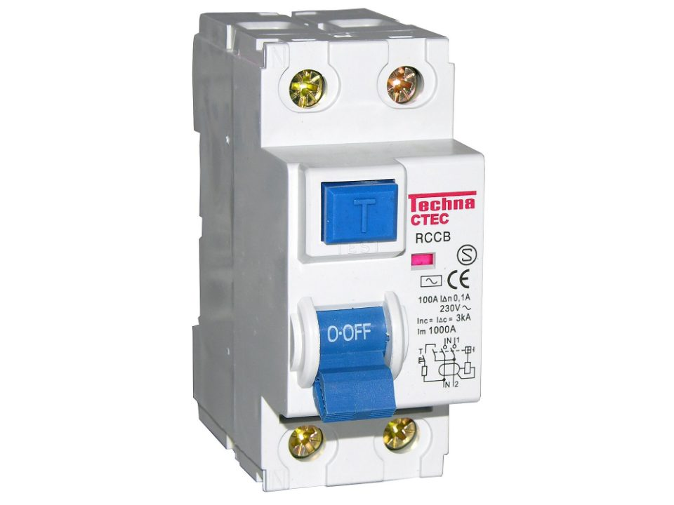

Modern switchboards have safety switches, and the wiring rules require them on most circuits in new homes. They're one of the most important safety devices in a building, and the idea behind them is surprisingly simple.

## Out and back

Electricity flows in a loop. It goes out along the active, the wire that carries the power, and comes back along the neutral.

When everything is working, the current going out is exactly the same as the current coming back. A safety switch, also called an RCD (residual current device), watches both at once.

## When they don't match

If some of the current finds another way home, the two stop matching. That other way might be a damaged appliance leaking to its metal case, water getting into a fitting, or a person touching something live.

A safety switch notices the difference and turns the circuit off. The ones that protect people react to a very small leak, usually 30 milliamps (thousandths of an amp), and they act in a fraction of a second.

## Not the same as a circuit breaker

A circuit breaker cares about how much current flows. It trips when there's too much, which protects the cables from overheating.

A safety switch doesn't care about the amount. It cares whether it all comes back. A leak through a person can be far too small to bother a circuit breaker and still be deadly, and that's the gap a safety switch covers.

## The test button

Most safety switches have a test button, usually marked T. Inside, it creates a small, deliberate imbalance, so the device can show it still trips when it should.

## One device, or two in one

Some devices combine a circuit breaker and a safety switch in a single module. They're called RCBOs. With one on each circuit, a fault on one circuit doesn't turn off several others at the same time.

## When one keeps tripping

A safety switch that keeps turning off is doing its job. It's telling you something is leaking. Finding out what, and fixing it, is work for a licensed electrician.

## Photo credits

- Safety switch: [Residual current device 2pole](https://commons.wikimedia.org/wiki/File:Residual_current_device_2pole.jpg) by Jimbob82, released into the public domain, via Wikimedia Commons. Placed on a wider white background for this page.
- The diagram was drawn for this site.
