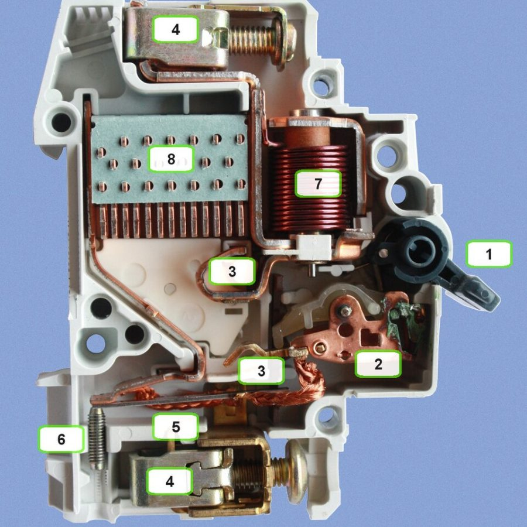

When the power to part of a building suddenly goes off, the usual reason is a circuit breaker doing exactly what it's meant to do.

## What it protects

Every cable can carry a certain amount of current before it gets too hot. A circuit breaker sits at the start of a circuit and turns it off before the cable reaches that point.

It's there to protect the wiring, so the wiring never becomes the thing that starts a fire.

## Two kinds of trouble

Inside most circuit breakers are two separate ways of tripping, one for each kind of problem.

The first is for an overload: a bit too much current for too long, like several heaters running on one circuit. A strip made of two different metals bends as it warms up, because the two metals expand at different rates. Once it bends far enough, it trips the breaker. It's deliberately slow, so a short burst, like a motor starting, doesn't set it off.

The second is for a short circuit, where the active touches the neutral or earth and current rushes through with almost nothing to hold it back. A coil inside the breaker turns into a magnet and snaps the contacts open almost instantly.

## The spark in the middle

Pulling two contacts apart while current is flowing creates an arc, a spark that tries to keep jumping the gap.

Circuit breakers have an arc chute to deal with it. It's a stack of metal plates that splits the arc into smaller pieces and cools it until it goes out.

## Which one tripped

A breaker that trips after a while, when lots of things are running, is usually reacting to an overload. One that trips the instant something is switched on points to a fault.

Either way, the breaker isn't the problem. It's the messenger, and finding the cause is a job for a licensed electrician.

## Photo credits

- Circuit breaker: [MCB Hager C10](https://commons.wikimedia.org/wiki/File:MCB_Hager_C10.jpg) by Marco-279, licensed under [CC BY-SA 4.0](https://creativecommons.org/licenses/by-sa/4.0/), via Wikimedia Commons. Cropped for this page, and the cropped version is shared under the same licence.
