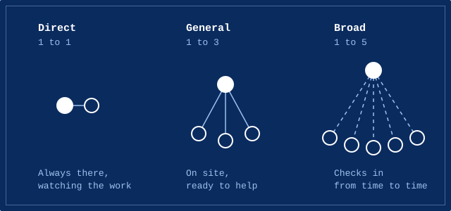
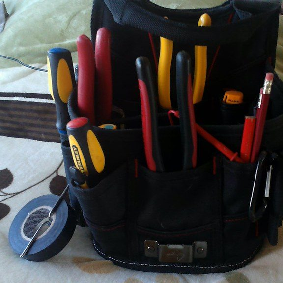

An apprentice never does electrical work on their own authority. A licensed electrician is responsible for it, and in NSW, how closely they have to supervise is set out in a rule called the Supervision Practice Standard.

## A rule, not a suggestion

The standard has been a condition of every electrician's licence since 1 September 2024. Only a licensed electrician can supervise electrical apprentices.

A supervisor who doesn't follow it can face fines, or have their licence suspended or cancelled.

## Three levels

Direct supervision is one on one. The supervisor stays physically present, with a clear view of the work, the whole time. One licensed electrician can directly supervise one apprentice.

General supervision is for when an apprentice needs guidance now and then. The supervisor stays on site and ready to help. The ratio is one electrician to three apprentices.

Broad supervision is for apprentices who can work to instructions and only need occasional face-to-face checks to make sure the work complies. One electrician can broadly supervise up to five apprentices.

## Who decides

Each time work is handed out, the supervisor decides which level fits, based on the task and how experienced the apprentice is. So the level can change from one task to the next.

## The apprentice's side

Apprentices have obligations too. They're expected to stay within the tasks and the level of supervision they've been given, and not go further on their own.

The standard also sits on top of normal work health and safety law. It doesn't replace it.

## Why it matters to me

It means the independence comes in steps, as experience builds. That's how it should be in a trade where mistakes can hurt people.

The details are on the NSW Government's page about the [Supervision Practice Standard](https://www.nsw.gov.au/housing-and-construction/compliance-and-regulation/electricians/supervision-practice-standard-for-licensed-electricians-supervising-apprentices).

## Photo credits

- Tool bag: [Electrician tools kit.](https://www.flickr.com/photos/183861591@N05/48642183578) by mikemaciash1, licensed under [CC BY 2.0](https://creativecommons.org/licenses/by/2.0/), via Flickr. Cropped for this page.
- The diagram was drawn for this site.
