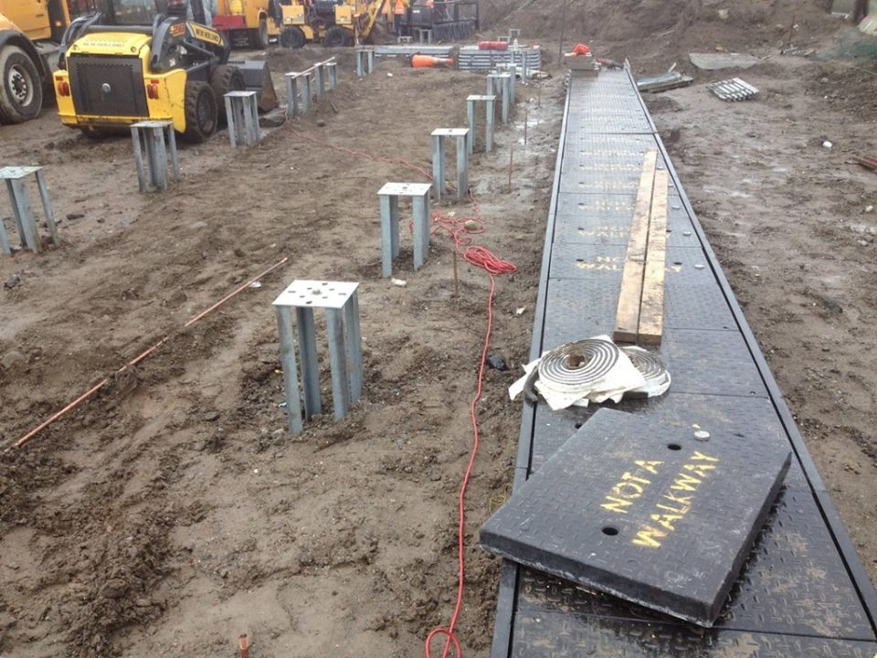

Of the three wires in a typical circuit, the earth is the odd one out. On a normal day, it carries no current at all.

## A path for when things go wrong

Plenty of appliances and fittings have metal cases. If a loose wire inside ever touched that metal, the case would become live, and the next person to touch it could get a shock.

The earth wire connects metal parts like these back to the earthing system. If something live ever touches them, the current has an easy path to follow that doesn't go through a person.

## Why that turns the power off

That easy path lets a lot of current flow at once, which is exactly what a circuit breaker is waiting for. The breaker trips, and the faulty circuit goes dead.

The current also stops coming back along the neutral, so a safety switch notices the mismatch and trips as well.

## Where the earth actually is

In a building, the earth wires from every circuit meet at the switchboard. From there, a main earth conductor runs to an electrode in the ground, often a metal rod.

In Australia, the earthing system and the neutral are also joined at the main switchboard. That link gives fault current a low-resistance way back to the supply, so enough of it flows to trip the breaker straight away.

## Green and yellow, always

In Australia, earth conductors are green and yellow, and those colours aren't used for anything else. That way, nobody mistakes the earth for a wire that's meant to carry power.

## Why it gets tested

A broken or missing earth gives no warning. Everything keeps working normally, right up until the day the earth is needed.

That's why earthing is one of the things tested before an installation is put into service, and why it's tested again whenever the wiring changes.

## Photo credits

- Earth rods: [FHL02 - Installing Ground Rods for H3 Hut (01-14-2014)](https://www.flickr.com/photos/59595815@N03/11984887275) by MTA C&D East Side Access, licensed under [CC BY 2.0](https://creativecommons.org/licenses/by/2.0/), via Flickr. Resized for this page.
