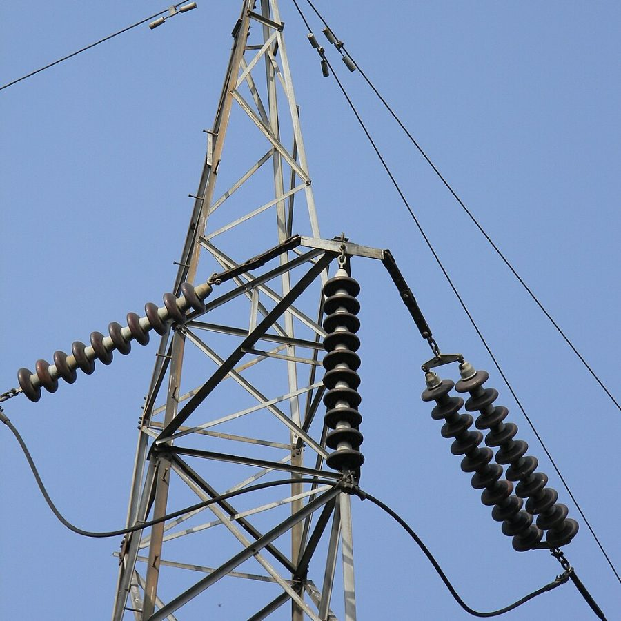
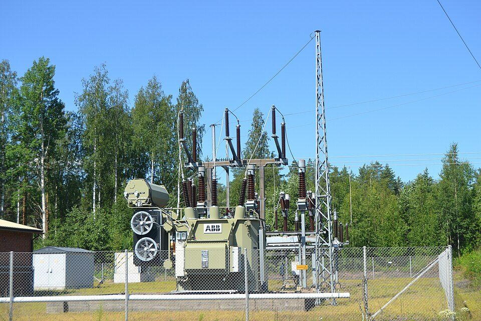

Flick a switch and the light comes on, but the power behind it has usually travelled a long way to get there.

## Made, then pushed up

Power stations and solar and wind farms generate electricity. Before it leaves, a transformer, a device that changes voltage, pushes it up to a very high voltage.

## Why the voltage goes up

Sending power at a high voltage means less current is needed to carry the same amount of energy. Less current means less energy lost as heat in the wires, which matters when the wires are hundreds of kilometres long.

## Stepping it back down

High-voltage lines end at substations. There, more transformers bring the voltage down for the local network that runs through the streets.

## The last step

Close to the buildings they supply, smaller transformers, either on power poles or in green boxes on the ground, bring the voltage down one last time.

In Australia, what comes out is 230 volts between an active and neutral. That's the standard supply voltage for homes and most buildings.

## Into the building

A cable called the service line brings the supply to the building, usually through a meter that records how much power is used.

The network's equipment ends at a point called the point of supply. Everything after that is the building's own electrical installation, starting at the main switchboard, and that's the part electricians spend most of their time on.

## Photo credits

- Transmission tower: [High Voltage Transmission Line Insulators - Howrah 2011-03-19 1872](https://commons.wikimedia.org/wiki/File:High_Voltage_Transmission_Line_Insulators_-_Howrah_2011-03-19_1872.JPG) by Biswarup Ganguly, licensed under [CC BY 3.0](https://creativecommons.org/licenses/by/3.0/), via Wikimedia Commons. Cropped for this page.
- Substation: [Muurame electrical substation transformer](https://commons.wikimedia.org/wiki/File:Muurame_electrical_substation_transformer.jpg) by Antti Leppänen, licensed under [CC BY 4.0](https://creativecommons.org/licenses/by/4.0/), via Wikimedia Commons. Resized for this page.
