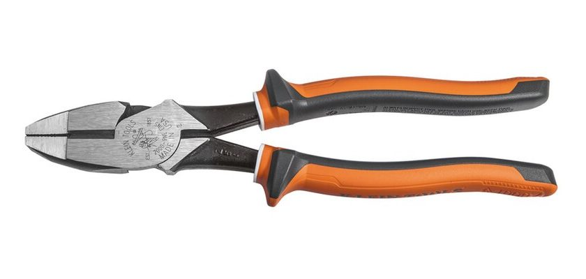

Look at an electrician's screwdrivers and pliers and you'll notice the handles are thick, coloured and run right up the shaft. That's insulation, and it's there for a specific reason.

## Rated, not just rubbery

Proper insulated hand tools are made to an international standard, IEC 60900. Tools that meet it are rated for work near live parts up to 1000 volts AC, and each one is tested at a much higher voltage before it leaves the factory.

They're marked with a symbol of two triangles, one above the other, and the voltage rating. A handle that just feels rubbery isn't the same thing.

## The last line of defence

Insulated tools are there for the moment something unexpected happens, like brushing against a part that should have been dead but wasn't.

They aren't a reason to work on live equipment. In Australia, work health and safety law only allows live electrical work in a small number of situations. The normal practice is to isolate the power, lock it off, and prove it's dead before any work starts.

## Looking after them

Insulation only protects while it's whole. A nick, a crack or a burn in the coating can let current through, so a damaged insulated tool is no longer one to rely on.

That's also why they're kept away from being used as hammers, pry bars or anything else that might damage the coating.

## Photo credits

- Side cutters: [Insulated Side-Cutting Pliers Klein Tools](https://commons.wikimedia.org/wiki/File:Insulated_Side-Cutting_Pliers_Klein_Tools.jpg) by Klein Tools, licensed under [CC BY-SA 4.0](https://creativecommons.org/licenses/by-sa/4.0/), via Wikimedia Commons. Cropped for this page, and the cropped version is shared under the same licence.
