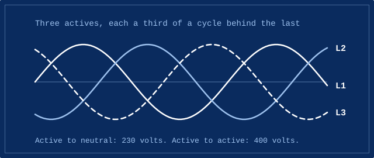
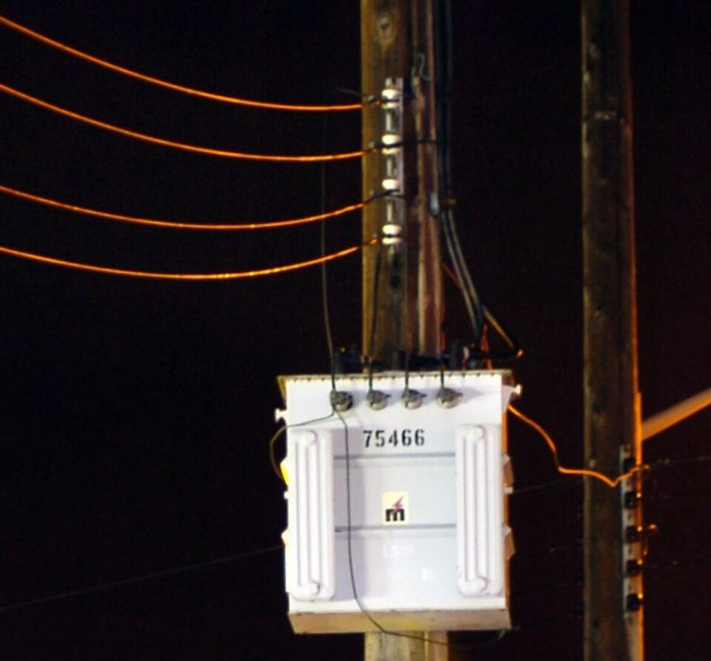

Most houses are supplied with single-phase power. Most commercial buildings get three-phase. The names sound technical, but the difference is easy to picture.

## One active or three

Mains power is alternating current. Instead of flowing steadily one way, it swings back and forth many times a second, rising and falling like a wave.

Single-phase power has one active carrying that wave, plus a neutral. In Australia, the voltage between them is 230 volts.

Three-phase power has three actives. Each one carries the same wave, but they take turns: each reaches its peak a third of a cycle after the one before.

## Why take turns

Because the three waves peak at different moments, there's always at least one of them near its peak. Together they deliver power far more evenly than a single wave can.

That evenness matters for large motors, like the ones in lifts, pumps, air conditioning plant and workshop machinery. Three-phase motors start on their own and run smoothly, which is a big part of why commercial and industrial buildings use it.

## 230 and 400

The voltage between any active and neutral is still 230 volts. Between two actives, it's about 400 volts. That's why three-phase equipment is designed for it specifically, and why a three-phase supply has its own kinds of plugs and outlets.

## Where houses fit in

The street network is three-phase. Many houses are connected to just one of the three phases, and the network spreads houses across all three to keep the load balanced.

## Photo credits

- Pole transformer: [Three-phase pole-mount transformer closeup (sharpened and releveled)](https://commons.wikimedia.org/wiki/File:Three-phase_pole-mount_transformer_closeup_%28sharpened_and_releveled%29.jpg) by Glogger at English Wikipedia, licensed under [CC BY-SA 3.0](https://creativecommons.org/licenses/by-sa/3.0/), via Wikimedia Commons. Resized for this page, and shared under the same licence.
- The diagram was drawn for this site.
