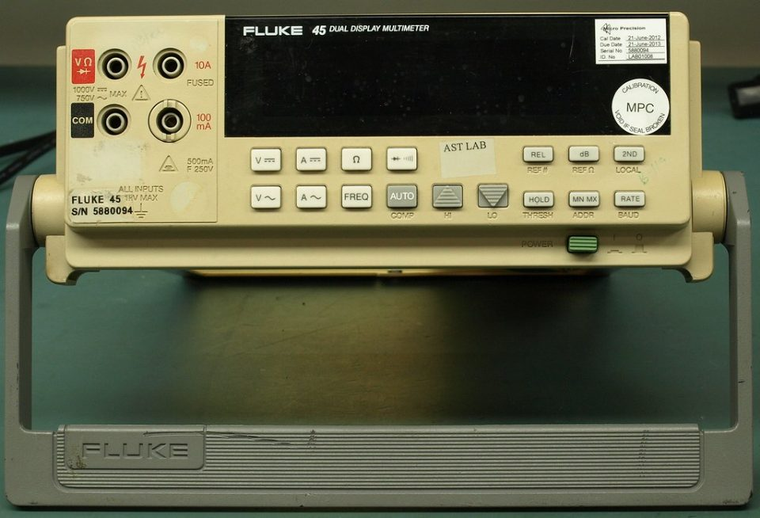

One of the two promises behind Salt and Light Electrical is clear records. Before I can keep that promise, it helps to know what the law already asks for.

## The certificate

In NSW, whenever electrical wiring work is done, the electrician has to submit a Certificate of Compliance for Electrical Work, known as a CCEW.

It shows the work has been tested and complies with the regulations and the relevant Australian Standards, including the wiring rules, AS/NZS 3000.

## Tested first, then certified

The person who carries out the electrical test is the one who submits the certificate. It has to go in as soon as practical, and no later than seven days after the test.

Since 1 July 2026, every CCEW has to be lodged through Building Commission NSW's online portal, BCNSW eCert. Paper and PDF forms are no longer accepted.

## Who gets a copy

Once it's lodged, copies can go automatically to the people who need them. That can include the customer, the electrician's employer, and the electricity distributor when the work affects the network connection.

The NSW Government notes a CCEW can also help a customer with warranty claims for whatever was installed.

## What I'd add

The certificate proves the work was tested and complies. It doesn't tell the next electrician much about where things are or why they were done a certain way.

For that, I want every job to leave a few more things behind: a switchboard where every circuit is labelled, a schedule that matches the labels, and drawings that are kept up to date, like the single-line diagrams I wrote about earlier.

It's more work at the end of a job. It saves someone a lot more work later.

The rules are on the NSW Government's page about [electrical compliance requirements](https://www.nsw.gov.au/housing-and-construction/compliance-and-regulation/electricians/electrical-compliance-requirements).

## Photo credits

- Test instrument: [Fluke 45 Multimeter Teardown](https://www.flickr.com/photos/58072483@N02/21137454091) by eevblog, released under [CC0 1.0](https://creativecommons.org/publicdomain/zero/1.0/), via Flickr. Resized for this page.
