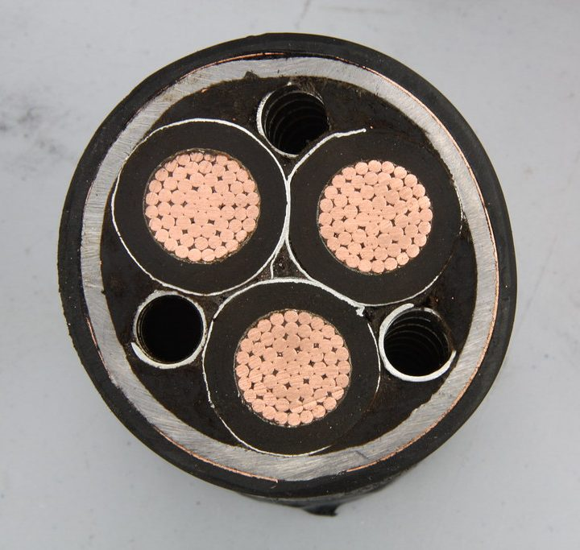

From the outside, most power cables look like plain grey or black tubes. Cut one open and there's a lot more going on.

## The conductors

At the centre are the conductors, the parts that actually carry the current. They're usually copper, sometimes aluminium in larger cables.

Some small cables use a single solid wire for each conductor. Most use several strands twisted together, and flexible cords use many fine strands, so they bend without breaking.

## The insulation

Each conductor has its own layer of insulation, usually a plastic such as PVC or a tougher material called XLPE. It keeps the current in its own conductor and stops it reaching the others.

The colour of that insulation tells you which conductor is which. In Australia, green and yellow always means earth.

## The sheath

Around everything is the sheath, the outer layer that protects the insulation from damage, sunlight and moisture.

Bigger cables can have more layers again: fillers to keep the round shape, metal screens, and armour for cables that run underground or somewhere they might get hit.

## Why size matters

The more current a conductor carries, the hotter it gets. A bigger conductor has less resistance, so it can carry more current before it gets too hot.

How a cable is installed matters too. Cables bundled together, or buried in insulation, can't shed heat as easily, so they can safely carry less. Choosing the right cable for the job is set out in Australian Standards, and it's one of the things licensed electricians are trained and responsible for.

## Photo credits

- Cable: [IMG_1067](https://www.flickr.com/photos/30661871@N03/35053477631) by RichardAsh1981, licensed under [CC BY-SA 2.0](https://creativecommons.org/licenses/by-sa/2.0/), via Flickr. Cropped for this page, and the cropped version is shared under the same licence.
