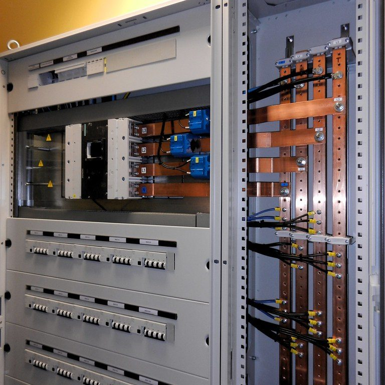

A house usually has one switchboard. A large commercial building has a whole family of them, and the way they connect is worth understanding.

## The main switchboard

Power comes into the building at the main switchboard, usually in a dedicated switchroom. It holds the main switch for the whole building, the main protection, and often the metering.

## Submains and distribution boards

From the main switchboard, large cables called submains run out to distribution boards around the building, often one or more on each floor or in each area.

Each distribution board then splits the power into final subcircuits: the individual circuits for lights, power points and equipment in that part of the building.

## Tripping in the right place

With protection at every level, it matters which device trips first. Ideally, a fault on one circuit trips only the breaker closest to it, leaving the rest of the floor, and the rest of the building, running.

Getting that right is called discrimination, or selectivity. It's planned when the switchboards are designed, by choosing protective devices that work together.

## Why the drawings matter so much here

In a building like this, nobody can hold the whole layout in their head. The single-line diagram, the labels on every board and the circuit schedules are how an electrician finds the right circuit to isolate.

Salt and Light Electrical plans to focus on commercial and technical work once it opens in 2032, and this is the kind of work where good records make the most difference.

## Photo credits

- Distribution board: [Open room distribution board](https://www.flickr.com/photos/65475777@N06/6934400882) by seeweb, licensed under [CC BY-SA 2.0](https://creativecommons.org/licenses/by-sa/2.0/), via Flickr. Cropped for this page, and the cropped version is shared under the same licence.
