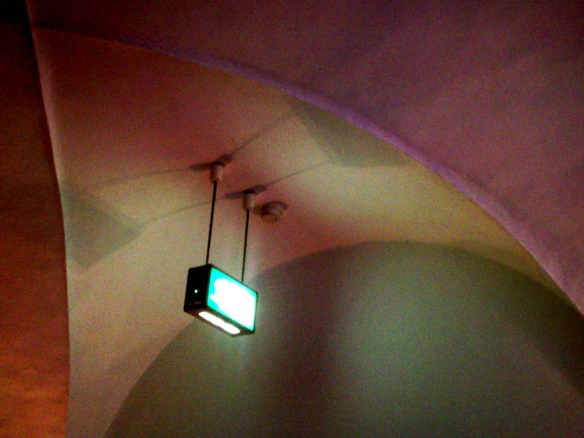

In most commercial buildings, there are lights that are waiting for the worst moment. They're the exit signs and emergency lights, and they're built to keep working when everything else stops.

## Two kinds of light

Exit signs show the way out. In Australia they show a green running figure and an arrow or a door. They're usually lit all the time.

Emergency lights are there to light up corridors and stairs when the normal lighting fails. Many of them sit dark until they're needed.

## Their own power

Most emergency lights and exit signs have a battery inside, kept charged by the normal supply. The moment the power fails, they switch to the battery.

Some larger buildings use a central battery system instead, feeding all the emergency lights from one place.

Either way, the batteries have to last long enough for everyone to get out. The minimum time is set by an Australian Standard.

## Tested on a schedule

A battery that has quietly died gives no warning until the power goes out. So emergency lighting has to be tested regularly, on a schedule set by the standard, including tests that run the lights on battery power for the full required time.

The results are recorded in a log book, so anyone can check the lights were tested and when. It's another kind of record that only matters on the day it's needed.

## Photo credits

- Exit sign: [Emergency Exit Sign](https://www.flickr.com/photos/68387408@N00/2991411339) by erix!, licensed under [CC BY 2.0](https://creativecommons.org/licenses/by/2.0/), via Flickr. Resized for this page.
