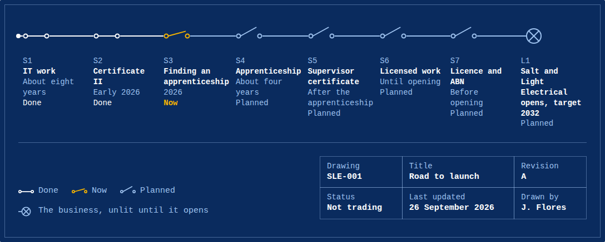

It's easy to assume an apprenticeship is the last step before opening an electrical business. In NSW, it's closer to the first.

## During the apprenticeship

Apprentices can't hold an electrical licence or certificate. Every piece of electrical work an apprentice does is supervised by a licensed electrician, under the rules I wrote about in the post on supervision.

## Tradesperson certificate

A tradesperson certificate lets someone do the kinds of electrical work listed on it, under the general supervision of a person who holds a contractor licence or a qualified supervisor certificate.

A tradesperson can't sign off on work. Someone with a higher licence has to do that.

## Qualified supervisor certificate

A qualified supervisor certificate lets someone do the work described on the certificate, and supervise others.

One of the pathways the NSW Government lists for getting one as an electrician is the Certificate III in Electrotechnology Electrician, plus at least 12 months of relevant electrical wiring experience using the wiring rules, AS/NZS 3000. That experience can be gained during or after the apprenticeship.

What it doesn't allow matters just as much. A qualified supervisor certificate doesn't allow you to contract or advertise for work.

## Contractor licence

A contractor licence is the one that allows someone to contract and advertise to do electrical work.

An individual contractor licence, also called an endorsed contractor licence, is only issued to people who hold the qualifications and experience needed to be a qualified supervisor. The licence card says "contractor licence (Q)" to show it.

Licences can be issued for one, three or five years.

## Where that leaves this site

This is why the road to launch has so many switches after the apprenticeship, and why this site doesn't offer any electrical work. Until I hold a contractor licence, I can't advertise it, so I don't. Salt and Light Electrical is planned to open in 2032, once I hold one.

The details are on the NSW Government's page about [applying for a licence](https://www.nsw.gov.au/business-and-economy/licences-and-credentials/building-and-trade-licences-and-registrations/apply).
