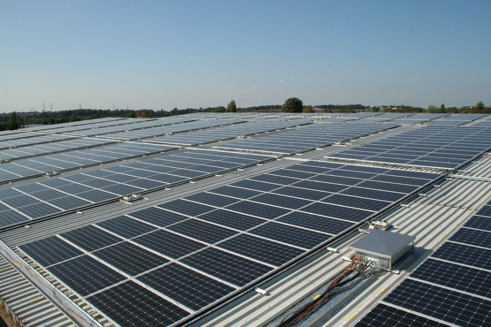
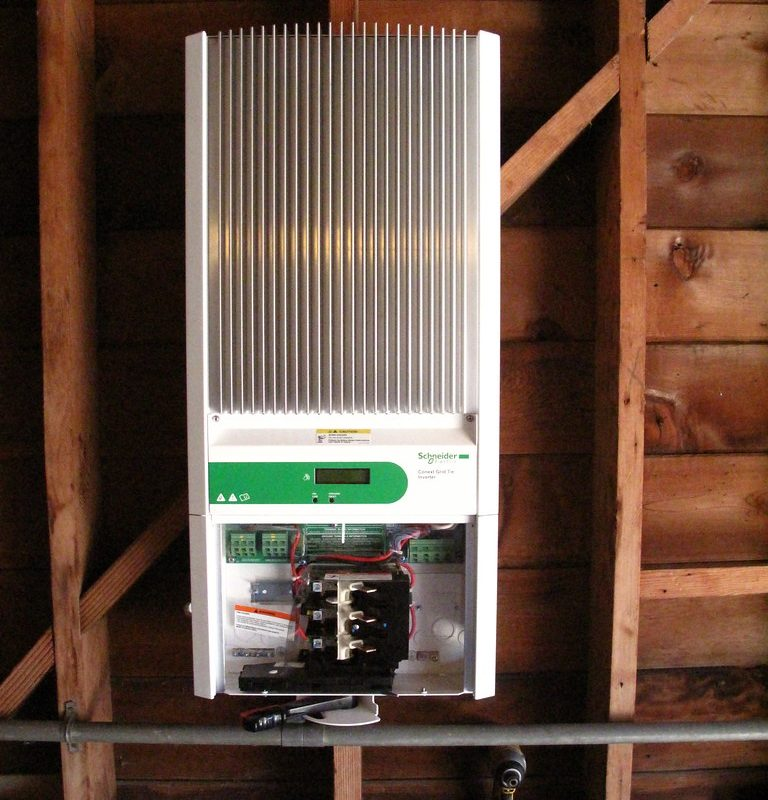

Solar panels are everywhere on Australian roofs now, and the way they connect to a building is simpler than the equipment suggests.

## Panels make direct current

Solar panels turn sunlight into direct current, or DC: current that flows steadily one way, like a battery's.

Buildings run on alternating current, or AC, which swings back and forth many times a second. So the panels' power can't go straight into the switchboard.

## The inverter

The inverter converts the DC from the panels into AC that matches the grid. It also keeps track of the grid's voltage and timing, so the power it produces lines up with the supply.

## Use it, then share it

The building uses the solar power first. If the panels are making more than the building needs, the extra flows out to the grid through the meter. When they're making less, the building draws the difference from the grid as usual.

A battery, if there is one, can store the extra for later instead.

## Why it switches off in a blackout

A grid-connected solar system stops feeding the grid when the grid goes down. Otherwise, it could make lines live that workers believe are dead.

## A safety point about the roof

The panels keep producing power whenever light hits them, even when the inverter is off. That's one reason solar systems are installed and worked on by licensed electricians with specific training.

## Photo credits

- Solar panels: [rooftop solar panels](https://www.flickr.com/photos/7718908@N04/6539456103) by h080, licensed under [CC BY-SA 2.0](https://creativecommons.org/licenses/by-sa/2.0/), via Flickr. Resized for this page, and shared under the same licence.
- Inverter: [Solar Inverter](https://www.flickr.com/photos/12463316@N00/9437491387) by DanielBL, licensed under [CC BY 2.0](https://creativecommons.org/licenses/by/2.0/), via Flickr. Cropped for this page.
