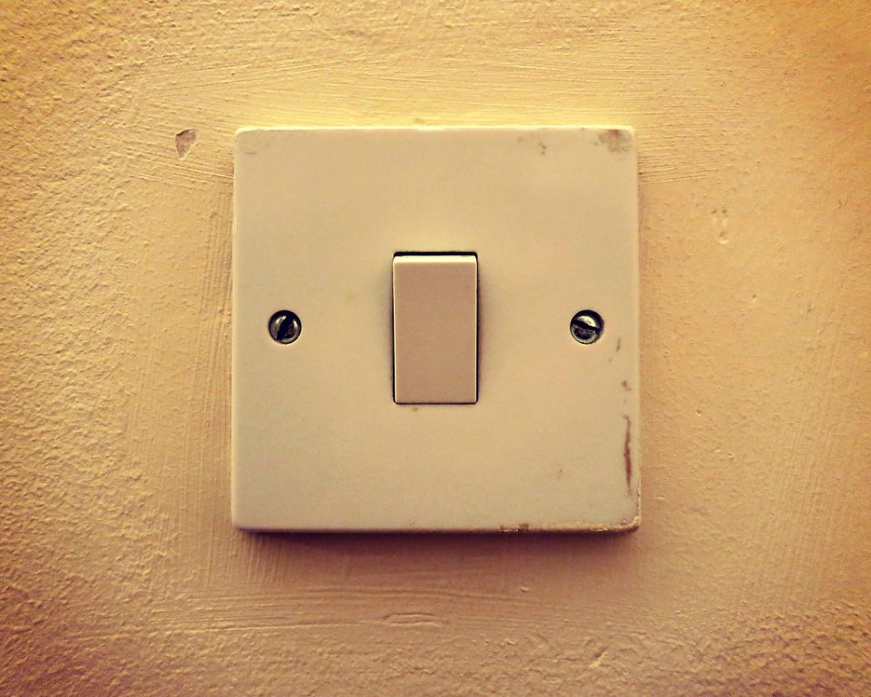

Walk into a long hallway, turn the light on at one end, and turn it off at the other. It seems like it shouldn't work, but it's one of the neatest ideas in everyday wiring.

## A different kind of switch

An ordinary switch connects or disconnects one wire. The switches used here, called two-way switches, have three terminals instead: one common terminal, and two others. Flipping the switch moves the connection from one of those two to the other.

## Two wires between them

Between the two switches run two wires, often called straps. Power comes into the common terminal of the first switch, and the light is connected to the common terminal of the second.

When both switches are set to the same strap, there's a complete path and the light is on. Flip either switch and the two no longer match, so the path breaks and the light goes off. Flip either one again and it's back on.

## More than two places

For three or more switch positions, like a long corridor with several doors, an intermediate switch sits in the middle of the straps. It swaps which strap goes where, so each switch in the chain can still turn the light on or off.

## Looks the same from the front

From the room, a two-way switch looks exactly like an ordinary one. The difference is all in the terminals behind the plate, which is one more reason that working behind the plate is a job for a licensed electrician.

## Photo credits

- Light switch: [Switch](https://www.flickr.com/photos/14226960@N00/9296951538) by lamdogjunkie, licensed under [CC BY 2.0](https://creativecommons.org/licenses/by/2.0/), via Flickr. Resized for this page.
- The diagram was drawn for this site.
